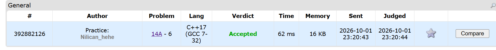

##### Thought process
Fairly straightforward problem. Need to calculate leftmost, rightmost columns and topmost and bottomost rows.
##### Key Mistakes
While calculating leftmost, I initially added it to !top condition, however, it is not true that the first row of answer rectangle will have shaded region at the leftmost column.
##### Screenshot
[Codeforces Link](https://codeforces.com/problemset/problem/14/A)
