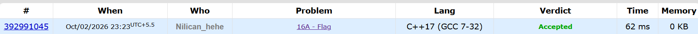

##### Thought process
Problem is categorically easy. Need to keep a check of prev colour. Can optimise it by not keeping a store vector and rather keeping track of first element of the row ( as all elements need to be same to first element ).
##### Key Mistakes
Did not check that input is not integers but character. Also prev should not be kept '-1' as that is multi-characters ( two characters ), so keep it '#'
##### Screenshot
[Codeforces Link](https://codeforces.com/problemset/problem/16/A)
