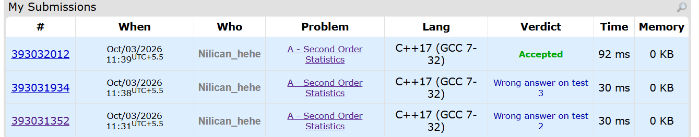

##### Thought process
Problem is standard array problem of finding second min number. Do take note that 1 2 1 1 3 does not mean secondmin is 1. Secondmin is 2. 
##### Key Mistakes
2 Errors in submission. 
Key Error 1: <= mistake. Cannot do <= for minum as duplicates will then make secondminnum=minum=1
Key Error 2: Check in elseif statement that num!=minum as now we have removed the = condition in upper if statement.
##### Screenshot
[Codeforces Link](https://codeforces.com/problemset/problem/22/A)
